# SlotSense — System Architecture Document (SAD)

**Project:** SlotSense (repository `slot-sense`, package `sport_slot`)
**Owner:** Chandra AI Labs
**Repository:** https://github.com/chandranakkalakunta/slot-sense
**Status at time of writing:** Phase 10 complete; Phase 17 (Production Readiness) in progress
**Document type:** System Architecture Document — multi-level (context → container → component → deployment)

> This document is derived directly from the repository source (backend `sport_slot`
> package, `frontend/`, `infrastructure/`, `terraform/`, `.github/workflows/`, and the
> project `README.md` / ADR set). Every component and connection described below maps to
> code or configuration that exists in the repo. Where the README and the code differ on a
> detail, the code is treated as authoritative and the discrepancy is called out explicitly.

---

## 1. Purpose and scope

SlotSense is a **multi-tenant SaaS platform** that lets Indian residential communities run
their own shared sports-facility bookings (tennis, badminton, cricket nets, etc.), keeping
booking revenue in-house instead of ceding 50–75% to third-party operators. Its defining
feature is a **natural-language AI booking assistant**: residents can say *"book my usual
tennis slot tomorrow"* and the agent proposes a structured booking that only executes on an
explicit confirmation.

This document describes the system's runtime components, the connections between them, and
the deployment topology. It is organized as a series of diagrams at increasing levels of
detail:

- **Level 0 — System Context:** who uses the system and what it depends on.
- **Level 1 — Container view:** the deployable/runtime units and the protocols between them.
- **Level 2 — Component view:** the internal structure of the backend and frontend.
- **Level 3 — Behavioural / low-level:** the agent's propose-confirm-execute flow, the voice
  pipeline, the distributed-lock booking sequence, and the request/auth lifecycle.
- **Deployment view:** the Google Cloud footprint, CI/CD, and networking.

---

## 2. Architecture at a glance

| Layer | Technology (from repo) |
|-------|------------------------|
| Frontend | React 18 · Vite 6 · TypeScript · pnpm · React Query 5 · react-router-dom 7 · Tailwind v4 · shadcn/ui (Radix) · lucide-react · Inter · PWA (Workbox) |
| Backend | Python 3.12 · FastAPI · uv · structlog · Pydantic Settings · `zoneinfo` per-tenant timezones |
| Data | Firestore (Native Mode) · Memorystore Redis · BigQuery (future federation) |
| AI | Vertex AI Gemini (function calling + output classifier); Cloud Speech-to-Text / Text-to-Speech for voice |
| Async / messaging | Cloud Tasks (notification dispatch), Cloud Scheduler (invoicing) |
| Email | Resend (verified domain `mail.chandraailabs.com`) |
| Infra | Cloud Run · Cloud Build · Artifact Registry · Firebase Auth · Firebase Hosting · Global HTTPS Load Balancer + Cloud Armor · Terraform · GitHub Actions with Workload Identity Federation |
| GCP project / region | `sport-slot-dev` · `asia-south1` |

**Architectural style:** layered, service-oriented monolith deployed as a container on Cloud
Run, with a clean separation of `middleware → routers → services → repositories → Firestore`.
The AI agent and voice pipeline are additional service modules that reuse the same booking
services rather than duplicating logic.

---

## 3. Level 0 — System Context

The outermost view: the actors who interact with SlotSense and the external services SlotSense
depends on.

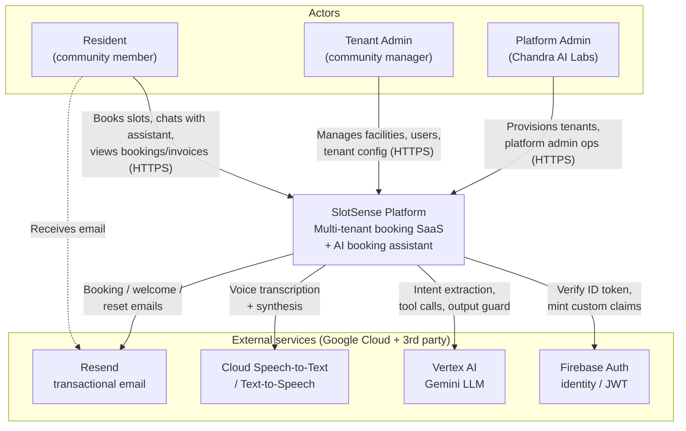

**Context-level connections**

| From | To | Purpose |
|------|----|---------|
| Resident / Tenant Admin / Platform Admin | SlotSense | All user interaction over HTTPS; each request carries a Firebase-issued JWT. Role is encoded as a custom claim (`resident`, `tenant_admin`, `platform_admin`). |
| SlotSense | Firebase Auth | Verifies the caller's ID token on every request; provisioning mints custom claims (`tenant_id`, `tenant_slug`, `household_id`, `role`). |
| SlotSense | Vertex AI (Gemini) | The agent calls Gemini to extract intent, choose a tool, phrase natural-language replies, and run the output classifier. |
| SlotSense | Cloud Speech-to-Text / TTS | The voice pipeline transcribes resident audio (en-IN) and synthesizes the reply. |
| SlotSense | Resend | Sends transactional email (booking confirmations, welcome, password reset) via an authenticated worker. |

---

## 4. Level 1 — Container View

The deployable units and the protocols between them. This is the primary "system architecture"
diagram: it shows the client, the Cloud Run service, the data stores, and every external
dependency.

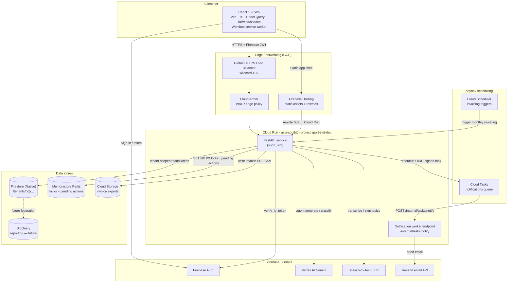

**Container-level connections**

| From | To | Protocol / mechanism | Description |
|------|----|----------------------|-------------|
| PWA | Load Balancer / Firebase Hosting | HTTPS | The browser loads the static app shell from Firebase Hosting; API calls go through the load balancer (Phase 8b) with wildcard TLS and a Cloud Armor edge policy. |
| PWA | Firebase Auth | HTTPS (Firebase SDK) | The frontend authenticates the user and obtains an ID token (`frontend/src/lib/firebase.ts`). |
| PWA | FastAPI | HTTPS + `Authorization: Bearer <JWT>` | All data operations. The API client lives in `frontend/src/lib/api.ts`. |
| FastAPI | Firebase Auth | Admin SDK | `firebase_admin.auth.verify_id_token` validates the JWT and reads custom claims (`auth/dependency.py`). |
| FastAPI | Firestore | Firestore SDK, tenant-scoped repositories | Canonical data store; all access flows through the repository layer which requires a `TenantContext`. |
| FastAPI | Memorystore Redis | `redis` async client | Distributed slot locks (`SET NX PX`) and single-use agent pending actions (5-min TTL). |
| FastAPI | Vertex AI | Vertex SDK | Agent intent/tool-calling turns and the output classifier. |
| FastAPI | Speech-to-Text / TTS | Google Cloud SDK | Voice transcription and synthesis (en-IN). |
| FastAPI | Cloud Tasks | Cloud Tasks SDK | Enqueues an OIDC-signed HTTP task to the notification worker (`notifications/tasks.py`). |
| Cloud Tasks | Worker endpoint | HTTP POST, OIDC token | Delivers `{event_type, to, params}` to `/internal/tasks/notify`; Cloud Tasks handles retry/backoff. |
| Worker | Resend | HTTPS API | Renders and sends the transactional email. |
| Cloud Scheduler | FastAPI | OIDC-authenticated HTTP | Triggers monthly invoicing (`api/internal/invoicing.py`, `auth/scheduler_auth.py`). |
| FastAPI | Cloud Storage | GCS SDK | Writes invoice export artifacts (`services/invoice_export.py`). |

---

## 5. Level 2 — Backend Component View

The internal structure of the FastAPI service (`backend/src/sport_slot`). A request travels
top-to-bottom: middleware → auth dependency → versioned router → service → repository →
Firestore, with Redis, Vertex AI, and Cloud Tasks attached to the service layer.

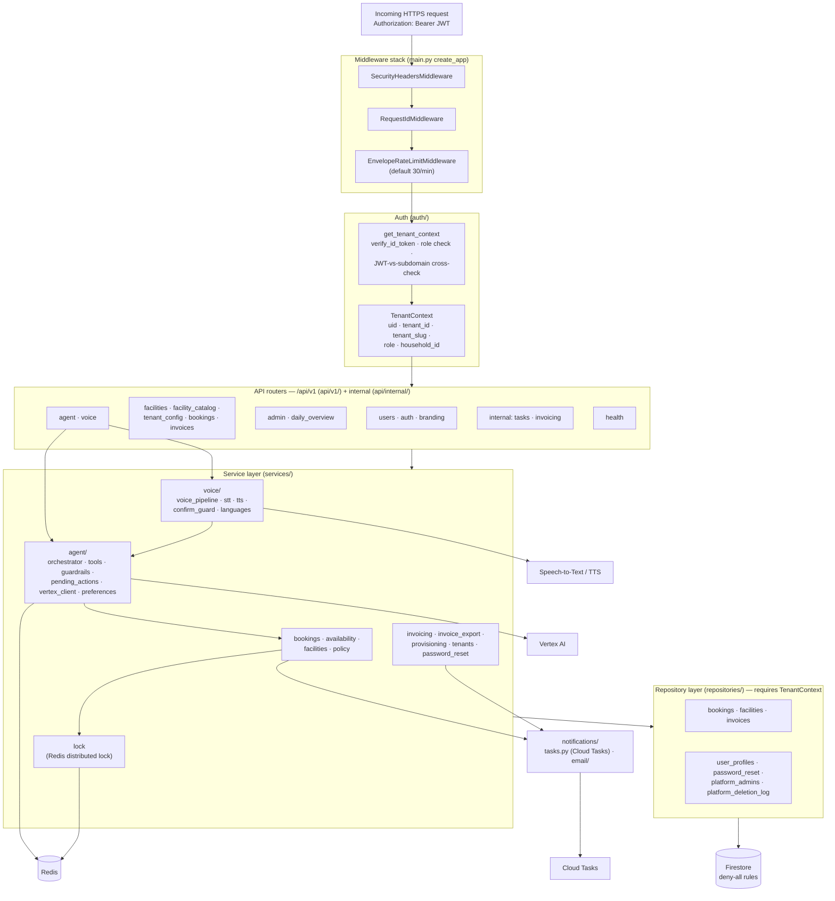

### 5.1 Middleware (`middleware/`, `ratelimit.py`)

Registered in `create_app()` and applied to every request:

- **SecurityHeadersMiddleware** (`middleware/security_headers.py`) — attaches security response
  headers.
- **RequestIdMiddleware** (`middleware/request_id.py`) — assigns/propagates a request ID for
  correlation in structured logs.
- **EnvelopeRateLimitMiddleware** (`ratelimit.py`) — applies a per-caller rate limit
  (default `30/minute`, configurable via `SPORTSLOT_RATE_LIMIT`) and returns a consistent error
  envelope.

Exception handlers are registered centrally (`api/errors.py`, `api/error_codes.py`) so all
routes emit a uniform error shape.

### 5.2 Authentication and tenant context (`auth/`)

`get_tenant_context` (`auth/dependency.py`) is the single security seam:

1. Requires an `Authorization: Bearer <token>` header.
2. Verifies the token with `firebase_admin.auth.verify_id_token`.
3. Requires a provisioned `role` claim; `platform_admin` gets a tenant-less context.
4. For tenant users, derives the tenant slug from the request host (`X-Forwarded-Host`/`Host`)
   and **cross-checks it against the JWT `tenant_slug` claim** — a mismatch on a recognized
   subdomain raises `403 TENANT_MISMATCH`. Unrecognized hosts (`*.web.app`, `*.run.app`,
   `localhost`) fall back to trusting the JWT (JWT is authoritative, ADR-0007/0012).
5. Produces an immutable `TenantContext(uid, tenant_id, tenant_slug, role, household_id)`
   (`auth/context.py`) that flows into every service and repository.

Supporting modules: `roles.py` (role gating), `credentials.py`, `password_policy.py`,
`scheduler_auth.py` and `tasks_auth.py` (authenticate Cloud Scheduler / Cloud Tasks callers to
the internal endpoints).

### 5.3 API routers (`api/v1/`, `api/internal/`)

`main.py` mounts a `/api/v1` router group plus unversioned `health` and `internal` routers.
Public v1 surface: `users`, `auth`, `branding`, `facilities`, `facility_catalog`,
`tenant_config`, `bookings`, `invoices`, `admin`, `daily_overview`, `agent`, `voice`. Internal
surface (machine-to-machine, OIDC-authenticated): `internal/tasks` (notification worker) and
`internal/invoicing` (scheduler-triggered billing).

### 5.4 Service layer (`services/`)

Business logic. Notable services:

- **`bookings.py` / `availability.py` / `facilities.py` / `policy.py`** — the booking domain:
  availability grid computation, booking creation/cancellation, per-tenant policy (timezones,
  quotas, cancellation buffers).
- **`lock.py`** — a Redis-backed distributed lock (`SET NX PX`, Lua owner-checked release) that
  serializes concurrent bookings for the same slot. **Fails closed**: if Redis is unreachable
  it raises `LockUnavailableError` (surfaced as `503`) rather than allowing a double booking.
- **`invoicing.py` / `invoice_export.py`** — monthly charge computation and export to Cloud
  Storage.
- **`provisioning.py` / `tenants.py`** — tenant and user provisioning (mints Firebase custom
  claims).
- **`password_reset.py`** — self-service reset flow.
- **`agent/`** — the AI booking assistant (see §7).
- **`voice/`** — the voice I/O pipeline (see §8).

### 5.5 Repository layer (`repositories/`)

Every repository is constructed with a `TenantContext` and scopes all Firestore reads/writes to
`/tenants/{tenant_id}/...`. This is **layer 2 of the five-layer tenant isolation** (see §6).
Repositories: `bookings`, `facilities`, `invoices`, `user_profiles`, `password_reset`,
`platform_admins`, `platform_deletion_log`, plus a shared `base.py`.

### 5.6 Notifications (`notifications/`)

`tasks.py` builds an OIDC-signed Cloud Tasks HTTP task targeting the worker endpoint
`/internal/tasks/notify`; the booking write has already committed before enqueue (non-blocking,
ADR-0019), so enqueue failures are loud. The `email/` package renders the message and Resend
delivers it.

---

## 6. Multi-tenant isolation (five layers)

Tenant isolation is a cross-cutting architectural property (ADR-0004), enforced in depth rather
than at a single choke point.

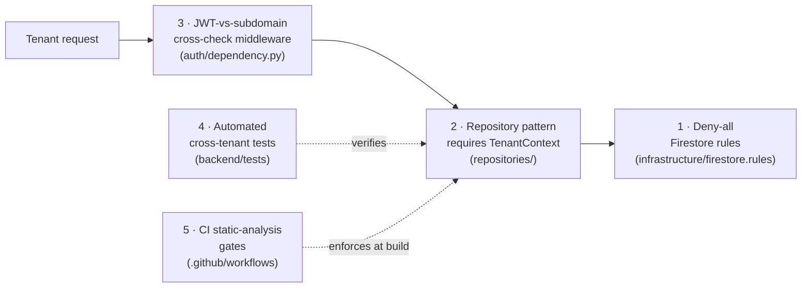

| Layer | Where | What it guarantees |
|-------|-------|--------------------|
| Deny-all Firestore rules | `infrastructure/firestore.rules` | No client can read/write Firestore directly; all access is server-mediated. |
| Repository requiring `TenantContext` | `repositories/base.py` + all repos | Data access is structurally scoped to one tenant path; a missing context is a construction error. |
| JWT-vs-subdomain cross-check | `auth/dependency.py` | A token minted for tenant A cannot be replayed on tenant B's subdomain. |
| Automated cross-tenant tests | `backend/tests/` | Regression proof that isolation holds. |
| CI static-analysis gates | `.github/workflows/pr-gates.yml` | Prevents merging code that bypasses the repository/context pattern. |

---

## 7. Level 3 — AI Agent: Propose–Confirm–Execute

The agent is the product's differentiator and its most safety-sensitive component. The core
invariant (ADR-0023): **the LLM never mutates state directly**. Every mutating action becomes a
structured *pending action* held in Redis with a 5-minute TTL, and is only executed after an
explicit user confirmation — and the confirm step involves **no LLM call at all**.

### 7.1 Agent component structure (`services/agent/`)

| Module | Responsibility |
|--------|----------------|
| `orchestrator.py` | The turn engine: `run_agent` (propose) and `run_agent_confirm` (execute). Routes tool calls, applies deterministic guards, never raises. |
| `tools.py` | The 7 tool schemas exposed to Gemini: `check_availability`, `list_my_bookings`, `book`, `cancel`, `get_my_preferences`, `get_my_invoices`, `get_my_current_month_charges`. |
| `pending_actions.py` | Redis-backed, single-use, tenant+uid-scoped pending-action store (5-min TTL). Scope is enforced by key construction. |
| `vertex_client.py` | Wraps Vertex AI generate + `classify_output`. |
| `guardrails.py` | Output guard: fast regex rules (block password/secret/token/api-key/uid/email; max 2000 chars) then an LLM classifier. Fails closed. |
| `preferences.py` | Reads the user's remembered "usual" facility/time per sport. |
| `text_format.py` | Strips Markdown to plain text (TTS-safe replies). |

### 7.2 Propose turn — read vs. book vs. cancel

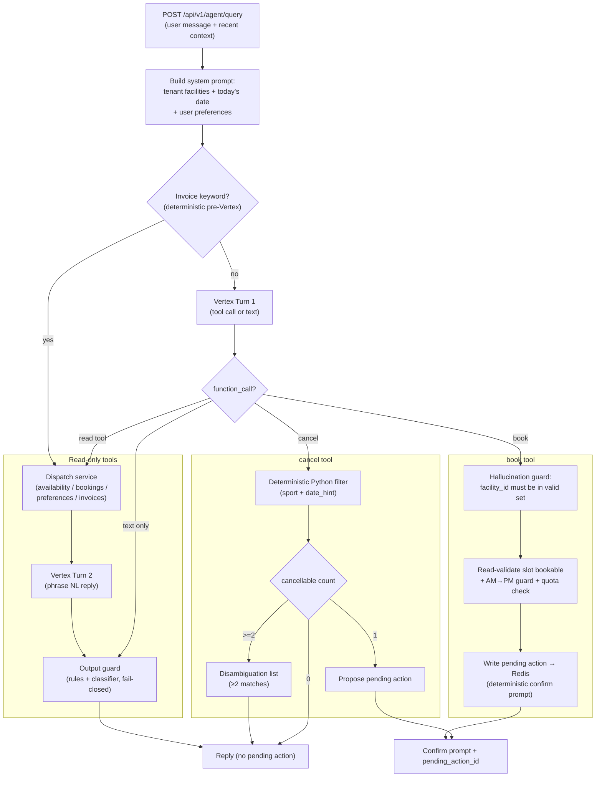

Key safety properties visible in `orchestrator.py`:

- **No `booking_id` ever reaches the LLM.** Cancellation candidates are filtered in pure Python;
  the model only supplies a sport and optional date hint. This structurally prevents ID
  hallucination.
- **`facility_id` hallucination guard.** On `book`, the requested `facility_id` must appear
  verbatim in the tenant's active facility set or the action is rejected.
- **Propose does not mutate.** The `book`/`cancel` paths write a pending action and return a
  deterministic confirmation prompt; they skip Vertex "Turn 2" and the output guard because the
  text is system-generated, not model-generated.
- **Deterministic invoice routing.** Invoice queries bypass Vertex entirely (whole-word keyword
  match) because Gemini's tool selection across the invoice tools was observed to be
  non-deterministic.

### 7.3 Execute (confirm) turn — no LLM

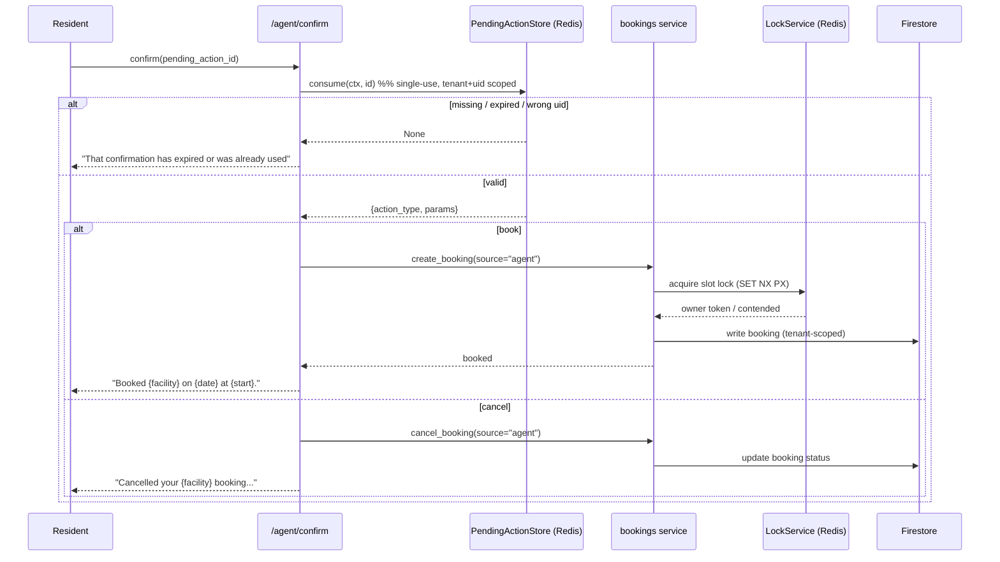

The confirm handler (`run_agent_confirm`) **makes no Vertex call**: it consumes the pending
action and passes its parameters verbatim to `create_booking` / `cancel_booking`. Errors from
the booking service (slot contended, quota exceeded, lock unavailable, etc.) are mapped to
friendly messages.

> **Model note:** the README describes the agent model as "Gemini 1.5 Pro". The code's
> configurable default (`config.py`, `SPORTSLOT_AGENT_MODEL`) is **`gemini-2.5-flash`**, with an
> LLM output classifier gated by `agent_output_guard_enabled`. The model is a configuration
> value, so the deployed model depends on environment settings.

---

## 8. Level 3 — Voice pipeline (`services/voice/`)

Voice I/O (ADR-0036/0037) is an additional edge in front of the *same* text agent — it adds no
new agent behaviour. The flow is deterministic where it matters (confirmation) and fails closed.

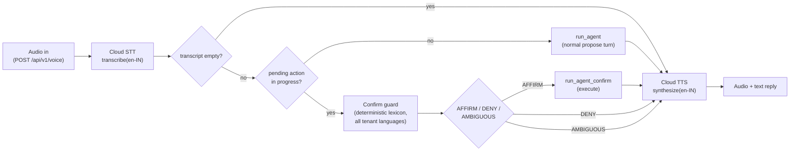

- The **confirmation branch never calls an LLM** to interpret yes/no. `confirm_guard.py` +
  `confirm_lexicon_data.py` classify the transcript against the tenant's configured language
  lexicons; any doubt resolves to `AMBIGUOUS` (fail-closed, re-prompt). This means the same
  safety guarantee as the text agent's confirm step.
- Current implementation is English-only (`en-IN`), but every language decision is routed
  through `resolve_tenant_voice_languages`, so multi-language support is a localized change.
- The pipeline "never raises" — STT failure, empty transcript, or TTS failure all degrade
  gracefully.

---

## 9. Level 3 — Booking with distributed lock

The core write path. Concurrency is the hard problem (two residents booking the same slot at
once); it is solved with a Redis distributed lock rather than optimistic Firestore transactions
alone.

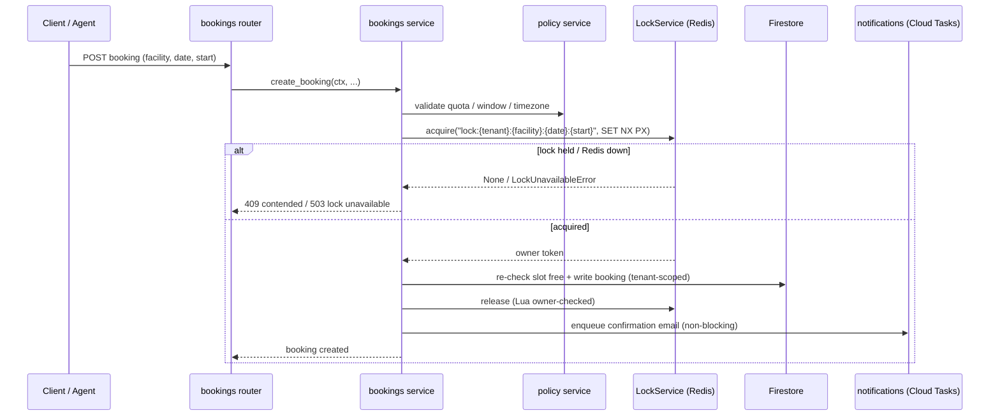

The lock key is `lock:{tenant_id}:{facility_id}:{date}:{start}` with a short TTL; release is a
Lua script that only deletes the key if the caller still owns it, so a client whose lock already
TTL-expired can never delete a successor's lock.

---

## 10. Level 3 — Request & authentication lifecycle

End-to-end path of a typical authenticated API call.

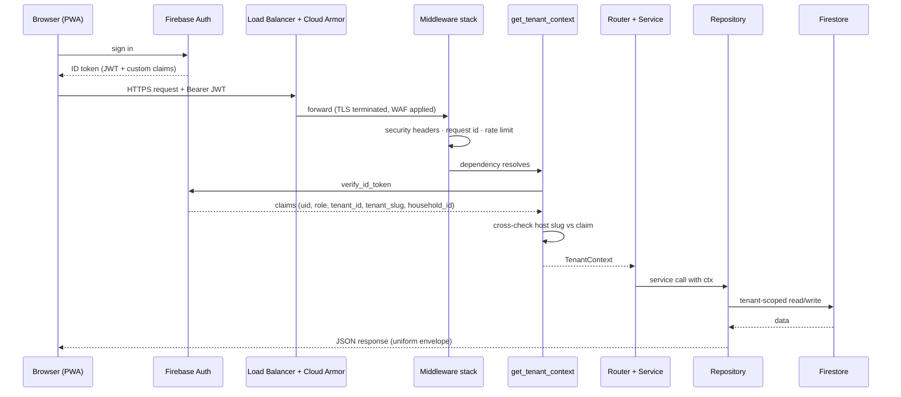

---

## 11. Frontend Component View (`frontend/src/`)

A React 18 single-page PWA. Per-tenant branding is applied at runtime from the subdomain; the
tenant's identity is primary in the header with a "powered by SlotSense" secondary attribution
(ADR-0029).

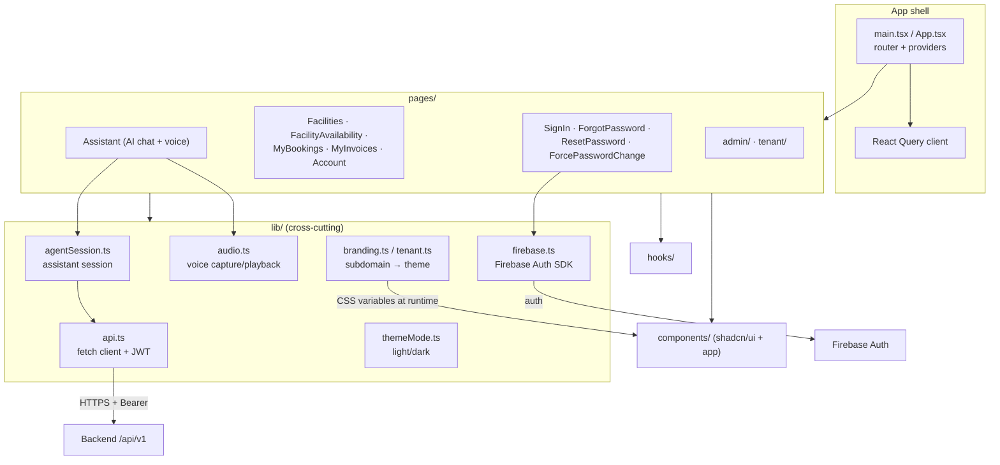

**Frontend building blocks**

| Area | Files | Role |
|------|-------|------|
| Shell | `main.tsx`, `App.tsx` | Router (react-router-dom 7), React Query provider, theme + branding bootstrap. |
| API access | `lib/api.ts` | Typed fetch client; attaches the Firebase JWT to every call. |
| Identity | `lib/firebase.ts`, `auth/` | Firebase Auth SDK sign-in, token refresh, route guards. |
| Assistant | `pages/Assistant.tsx`, `lib/agentSession.ts`, `lib/audio.ts` | Chat UI + voice capture/playback against `/agent` and `/voice`. |
| Booking UX | `pages/Facilities`, `FacilityAvailability`, `MyBookings`, `MyInvoices`, `Account` | Resident-facing flows. |
| Admin | `pages/admin/`, `pages/tenant/` | Tenant + platform administration. |
| Branding/theme | `lib/branding.ts`, `lib/tenant.ts`, `lib/themeMode.ts` | Subdomain-driven per-tenant colors/logo via CSS variables; light/dark mode. |
| Design system | `components/` (shadcn/ui, Radix), `styles/` | Tailwind v4 + Radix primitives; accessible components. |
| PWA | `vite.config.ts` (Workbox), `public/` | Installable app, cache strategy (no-cache HTML/manifest/SW, immutable hashed assets). |

---

## 12. Deployment View (GCP + CI/CD)

The system runs in Google Cloud project `sport-slot-dev`, region `asia-south1`, provisioned by
Terraform (`terraform/`). Deployment is via GitHub Actions using **Workload Identity Federation**
(no long-lived JSON service-account keys).

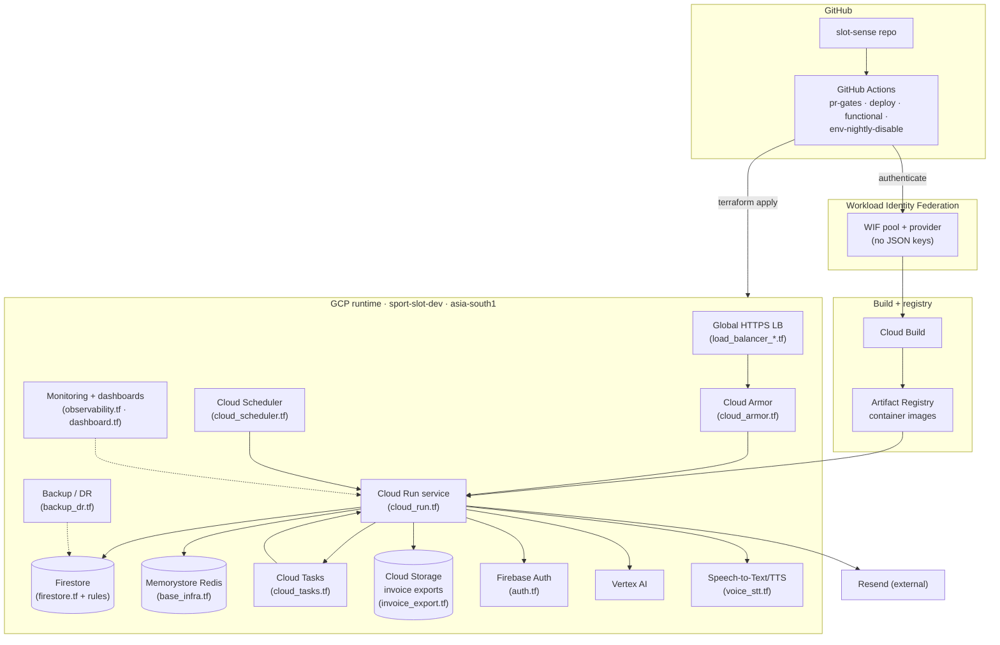

**Deployment / infrastructure connections**

| Element | Terraform file(s) | Description |
|---------|-------------------|-------------|
| Cloud Run service | `cloud_run.tf`, `iam.tf` | Hosts the FastAPI container; runs as a dedicated service account with least-privilege IAM. |
| Global HTTPS Load Balancer | `load_balancer_network.tf`, `load_balancer_backends.tf`, `load_balancer_routing.tf` | Public entry point with wildcard TLS and subdomain routing (Phase 8b). |
| Cloud Armor | `cloud_armor.tf` | Edge WAF/security policy in front of the backend. |
| Firestore | `firestore.tf`, `infrastructure/firestore.rules`, `infrastructure/firestore.indexes.json` | Native-mode database with deny-all rules and composite indexes. |
| Memorystore Redis | `base_infra.tf` | Distributed locks + agent pending actions. |
| Cloud Tasks | `cloud_tasks.tf` | Notification dispatch queue; OIDC-signed tasks to the worker. |
| Cloud Scheduler | `cloud_scheduler.tf` | Triggers monthly invoicing. |
| Cloud Storage | `invoice_export.tf` | Invoice export bucket (`sport-slot-dev-invoices`). |
| Firebase Auth | `auth.tf` | Identity provider; custom claims minted at provisioning. |
| Speech-to-Text / TTS | `voice_stt.tf` | Voice transcription/synthesis APIs. |
| Observability | `observability.tf`, `dashboard.tf` | Structured JSON logging, metrics, dashboards. |
| Backup / DR | `backup_dr.tf` | Backup and disaster-recovery configuration (Phase 17). |
| WIF | `wif.tf`, `wif_iam.tf` | Keyless GitHub Actions → GCP authentication. |
| APIs / cost | `apis.tf`, `cost.tf` | Enabled Google APIs; cost controls/budgets. |

**CI/CD workflows** (`.github/workflows/`): `pr-gates.yml` (lint, type-check, tests,
static-analysis isolation gates), `deploy.yml` (build + deploy via WIF), `functional.yml`
(functional/promotion suites), `env-nightly-disable.yml` (scheduled environment cost control).
`main` is branch-protected; ADRs precede code.

---

## 13. Cross-cutting concerns

| Concern | Approach (from repo) |
|---------|----------------------|
| **Security / isolation** | Five-layer tenant isolation (§6); deny-all Firestore rules; JWT-vs-subdomain cross-check; Cloud Armor at the edge; secret scanning (`.gitleaks.toml`). |
| **AI safety** | Propose-confirm-execute gate; no `booking_id`/`facility_id` hallucination reaches state; deterministic confirm (text and voice); output guard fails closed. |
| **Concurrency** | Redis `SET NX PX` distributed lock with owner-checked Lua release; fail-closed on Redis outage. |
| **Observability** | `structlog` structured JSON logging with request IDs; Cloud Monitoring dashboards (`observability.tf`, `dashboard.tf`). |
| **Configuration** | Pydantic `Settings` (`config.py`), env-prefixed `SPORTSLOT_`; dev/prod resolve identically. |
| **Resilience** | Cloud Tasks retry/backoff for notifications; voice pipeline degrades gracefully; backup/DR (`backup_dr.tf`). |
| **Testing** | 91%+ backend coverage with hermetic Firestore mocks; 238 frontend tests; 28 axe-core accessibility scans; layered promotion suites (ADR-0045). |
| **Timezones / i18n** | Per-tenant timezones via `zoneinfo` and `policy.py`; voice language resolver ready for multi-language. |

---

## 14. Known caveats and source-of-truth notes

- **Repository vs. product name.** The GitHub repo is `slot-sense` and the Python package is
  `sport_slot` (historical name `sport-slot-reservation`); the product was renamed to
  **SlotSense** in Phase 9. These names are used interchangeably in code paths and are not
  distinct systems.
- **Agent model.** Code default is `gemini-2.5-flash` (`config.py`); the README narrative cites
  "Gemini 1.5 Pro". Because the model is a configuration value, treat the deployed model as
  environment-dependent (§7.3).
- **Deferred scope.** Phase 8 hardening (CMEK, VPC, MFA, pen testing) is deferred; Phase 17
  (backup/DR, Terraform rebuild path, observability) is in progress at the time of writing.
  BigQuery federation is future work.
- **Authoritative records.** For finer detail than this SAD, the repository's own
  `docs/adr/` (Architecture Decision Records), `docs/SLOTSENSE_ARTICLE.md`, `docs/backlog.md`,
  and `CHANGELOG.md` are the canonical sources.

---

## 15. Component & connection reference (summary)

| # | Component | Type | Connects to | Connection description |
|---|-----------|------|-------------|------------------------|
| 1 | React PWA | Client | Backend API, Firebase Auth, Firebase Hosting | HTTPS + Bearer JWT for data; Firebase SDK for auth; static shell from Hosting. |
| 2 | Load Balancer + Cloud Armor | Edge | Cloud Run | TLS termination, WAF, subdomain routing to the backend. |
| 3 | FastAPI service | Compute | Firestore, Redis, Vertex AI, STT/TTS, Cloud Tasks, Firebase Auth, GCS | Central application; all business logic and integrations. |
| 4 | Middleware stack | Backend layer | Auth dependency | Security headers → request id → rate limit before any handler. |
| 5 | Auth dependency | Backend layer | Firebase Auth | Verifies JWT, builds `TenantContext`, cross-checks tenant. |
| 6 | Service layer | Backend layer | Repositories, Redis, Vertex, Cloud Tasks | Booking, policy, invoicing, agent, voice logic. |
| 7 | Repository layer | Backend layer | Firestore | Tenant-scoped data access requiring `TenantContext`. |
| 8 | Agent orchestrator | Service module | Vertex AI, Redis (pending actions), bookings service | Propose-confirm-execute; deterministic guards. |
| 9 | Voice pipeline | Service module | STT/TTS, agent orchestrator | Audio in/out around the unchanged text agent. |
| 10 | LockService | Service module | Redis | Distributed slot lock, fail-closed. |
| 11 | Notifications | Service module | Cloud Tasks → Worker → Resend | Async, OIDC-signed email dispatch. |
| 12 | Firestore | Data store | Repository layer | Canonical multi-tenant data (`/tenants/{id}/...`), deny-all rules. |
| 13 | Memorystore Redis | Data store | LockService, PendingActionStore | Locks + single-use pending actions (5-min TTL). |
| 14 | Cloud Tasks / Scheduler | Async | FastAPI worker/invoicing endpoints | Retryable notification delivery; scheduled invoicing. |
| 15 | Vertex AI Gemini | External AI | Agent | Tool-calling turns + output classifier. |
| 16 | Speech-to-Text / TTS | External AI | Voice pipeline | en-IN transcription/synthesis. |
| 17 | Resend | External | Notification worker | Transactional email delivery. |
| 18 | GitHub Actions + WIF | CI/CD | Cloud Build, Artifact Registry, GCP | Keyless build/deploy and Terraform apply. |

---

*Generated from the `slot-sense` repository source. Diagrams are Mermaid and render natively on
GitHub and in most Markdown viewers.*
